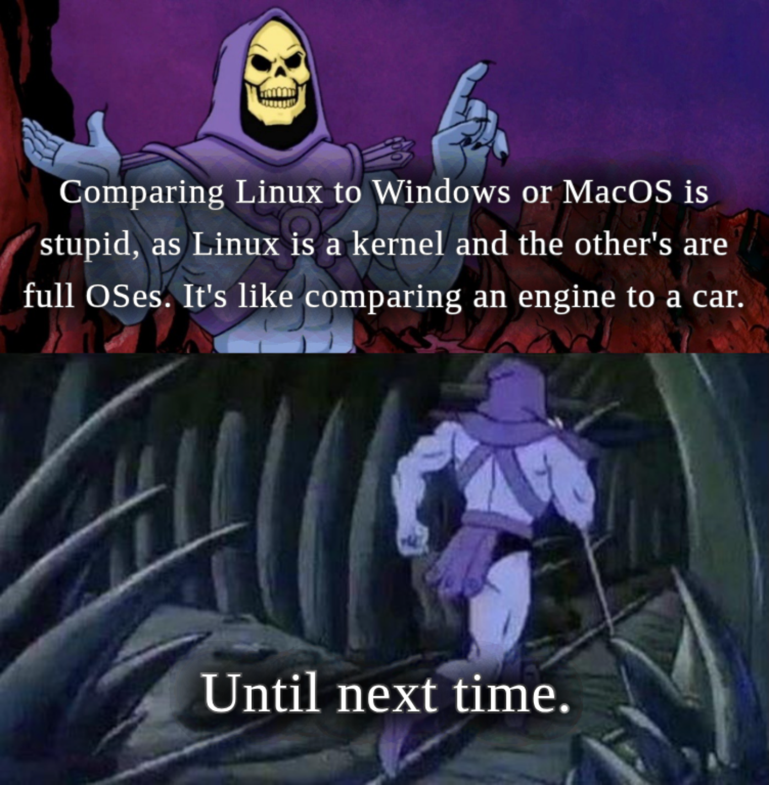
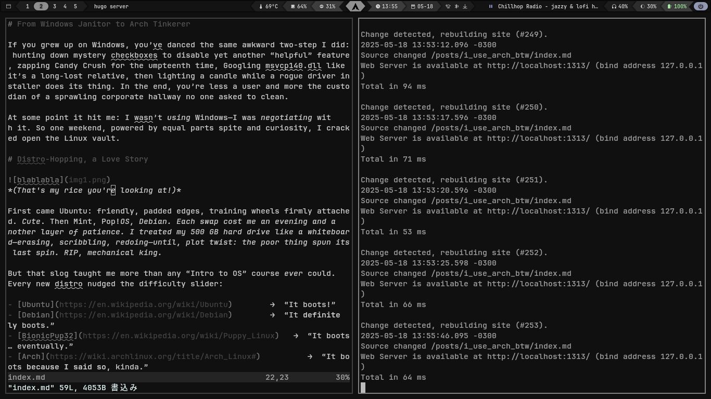
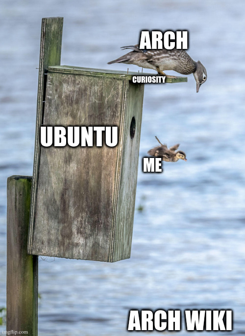

# From Windows Janitor to Arch Tinkerer

If you grew up on Windows, you’ve danced the same awkward two-step I did: hunting down mystery checkboxes to disable yet another “helpful” feature, zapping Candy Crush for the umpteenth time, Googling msvcp140.dll like it’s a long-lost relative, then lighting a candle while a rogue driver installer does its thing. In the end, you’re less a user and more the custodian of a sprawling corporate hallway no one asked to clean.

At some point it hit me: I wasn’t _using_ Windows—I was _negotiating_ with it. So one weekend, powered by equal parts spite and curiosity, I cracked open the Linux vault.

(And yes, I know — Linux is technically just the kernel. We’re all just speaking shorthand here.)

# Distro-Hopping, a Love Story

*(That's my rice you're looking at!)*

First came Ubuntu: friendly, padded edges, training wheels firmly attached. _Cute_. Then Mint, Pop!_OS, Debian. Each swap cost me an evening and another layer of patience. I treated my 500 GB hard drive like a whiteboard—erasing, scribbling, redoing—until, plot twist: the poor thing spun its last spin. RIP, mechanical king.

But that slog taught me more than any “Intro to OS” course _ever_ could. Every new distro nudged the difficulty slider:

- [Ubuntu](https://en.wikipedia.org/wiki/Ubuntu)        →  “It boots!”
- [Debian](https://en.wikipedia.org/wiki/Debian)        →  “It **definitely** boots.”
- [BionicPup32](https://en.wikipedia.org/wiki/Puppy_Linux)   →  “It boots… eventually.”
- [Arch](https://wiki.archlinux.org/title/Arch_Linux#)          →  “It boots **because I said so**, kinda.”

By the time I reached Arch, I’d earned the right to call my machine _mine_. Lightning-fast boot, zero bloat, RAM usage that finally respected my humble hardware. More importantly: every breakage became a puzzle. And fix enough puzzles? You start gaining XP in troubleshooting, scripting, even a bit of DevOps swagger.

# Arch Isn’t a Flex—It’s a Classroom

People assume Linux is only for sysadmins or three-monitor hackers. Nope. <a href="https://wiki.archlinux.org/title/Arch_Linux#Pragmatism" target="_blank">Arch’s DIY Philosophy</a> is basically a crash course in:

1. **Planning** – Partition tables, mount points, fstab—your install script is your blueprint.
2. **Problem-Solving** – Mis-type one flag, watch the kernel panic, then learn exactly why.
3. **Dev Intuition** – You compile stuff, tweak configs, and suddenly CI/CD docs start making sense.
4. **Design** – Try ricing a tiling WM without color theory—you’ll accidentally invent a new kind of eye strain.

It’s the ultimate sandbox: break, patch, iterate. And yes, sometimes you’ll nuke Xorg at 2 a.m. and end up talking to a black screen like it’s an ex who ghosted you. Part of the charm.

# Why I’m Sticking With It

I won’t pretend Arch is painless. It’s not.
But honestly? It’s like learning a new language. Messy and unstable at first—sure. But as you grow more fluent, it becomes unironically _more comfortable_ than Windows ever was.

That said — I haven’t abandoned Windows entirely. I still dual boot and jump back in when I need to run apps like Photoshop, Audacity, Sony Vegas, or when I just want to play a game without debugging shader errors at 1 a.m. It’s a tool. I use it when it does the job best.

But every rough edge Arch throws at me teaches something useful. And that deal? That’s worth it. I don’t just want a machine that works — I want one that works for me.

And out of all the distros I flirted with, Arch is the one that stuck. Not because it’s the easiest (it’s not), or the friendliest (it’s definitely not), but because it gives you everything — with documentation. The Arch Wiki is the holy book. Sometimes cryptic, sometimes brutal, occasionally sprinkled with snark, but always there when you need it. At first, it feels like reading IKEA instructions written by a Swedish hacker. But the more you break things, the more you get it. You learn its rhythms. Eventually, it’s not just documentation — it’s your co-pilot.

It doesn’t hold your hand, it just leaves the map on the table and says, “Good luck.” And weirdly? That’s exactly what I needed.

So yeah — <a href="https://knowyourmeme.com/memes/btw-i-use-arch" target="_blank">I use Arch, BTW</a>.
Not because it’s cool, not because I want to flex. But because it reminded me that my computer is programmable, not just “usable.”
And now? It’s both. Heck yeah.

